# Off The Hook?

### _Unit 7 Homework Assignment: Looking for Suspicious Transactions_

## Task 1. [Data Modeling](#Data-Modeling):

*An ERD is created below following instructions on Quick Database Diagrams for on one-to-one and one-to-many relationships between* 
* card holders, credit cards, merchants, merchant categories, transaction dates and amounts

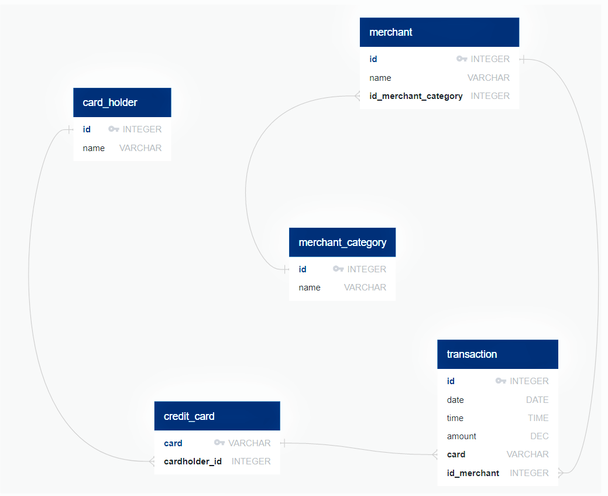
*[Quick Database Diagrams](https://app.quickdatabasediagrams.com/#/d/P2duCE)*
    * [ERD input on website](Answers/Code/ERD.txt)
        * where PK indicates a primary key, FK indicates a foreign key, >- indicates many to one, TIMESTAMP records both date and time into PostgresSQL 

## Task 2. [Data Engineering](#Data-Engineering): Create a database schema on PostgreSQL and populate your  database from the CSV files provided.
* Create a database in postgres 11 on port 5433 called "fraud_detection"
* Use the sql code exported from Quickdatabase Diagrams to create tables [Database schema](Answers/Code/table_schemata.sql)
* Import the following five csv files to the tables created correspondingly, checking header and delimiter as ","

### Data Files

* [card_holder.csv](Answers/Data/card_holder.csv)
* [credit_card.csv](Answers/Data/credit_card.csv)
* [merchant.csv](Answers/Data/merchant.csv)
* [merchant_category.csv](Answers/Data/merchant_category.csv)
* [transaction.csv](Answers/Data/transaction.csv)

## Task 3. [Data Analysis](#Data-Analysis): Analyze the data to identify possible fraudulent transactions.

It's time to identify fraudulent transactions. In this part of the homework assignment, you will analyze the data and then create a report to present your findings. You can use a Jupyter Notebook, a markdown file, or a word processor. Your report should answer the following questions:

*How can you isolate (or group) the transactions of each cardholder?*
1. In [Queries to Detect Fraud](Answers/Code/queries.sql), a view is created to join 
    * cardholder id and names from [card_holder.csv](Answers/Data/card_holder.csv)
    * cards from [credit_card.csv](Answers/Data/credit_card.csv)
    * name of merchant categories from [merchant_category.csv](Answers/Data/merchant_category.csv)
    * name of merchants from [merchant.csv](Answers/Data/merchant.csv)
    * amount and date from [transaction.csv](Answers/Data/transaction.csv)
    in that order so that data is imported with relationships of foreign keys.
    
2. Order the newly joined data set [cardholder_trans](Answers/Data/cardholder_trans.csv) by cardholder ids.
    * Create a view called cardholder_transactions
    * transactions are grouped by 
        * cardholder ids from low to high
        * for each cardholder, date of transaction in 2018 from the earliest to most recent

3. (Optional): For added convenience in fraud detection, a view called cardholder_transaction is created following 
    * Step 1 above
    * Step 2: Ordered by transaction amounts from high to low, rounded to two decimal places
    * Step 3: a table [cardholder_tran](Answers/Data/cardholder_tran.csv) is generated in [Supplemental Queries](Answers/Code/queries_supplemental.sql)

*Consider the time period 7:00 a.m. to 9:00 a.m.*
  * What are the top 100 highest transactions during this time period?
      1. A view called "transaction_time" is created for all transactions from '07:00:00' to '09:00:00' in [Queries to Detect Fraud](Answers/Code/queries.sql)
          * from [cardholder_tran](Data/cardholder_tran.csv) in Step 3 (Optional) above
          * so that transactions are ordered from highest to lowest amounts
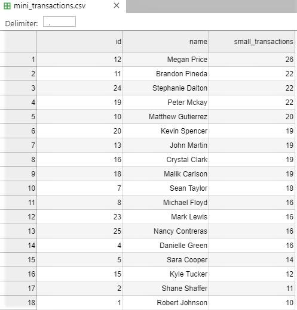
      2. Limit the number of transactions to 100 so that only the top 100 highest transactions from 7 to 9 am are included
          * create a view called "top_100_7to9"
          * generate table [top_100_07to09](Data/top_100_07to09.csv)
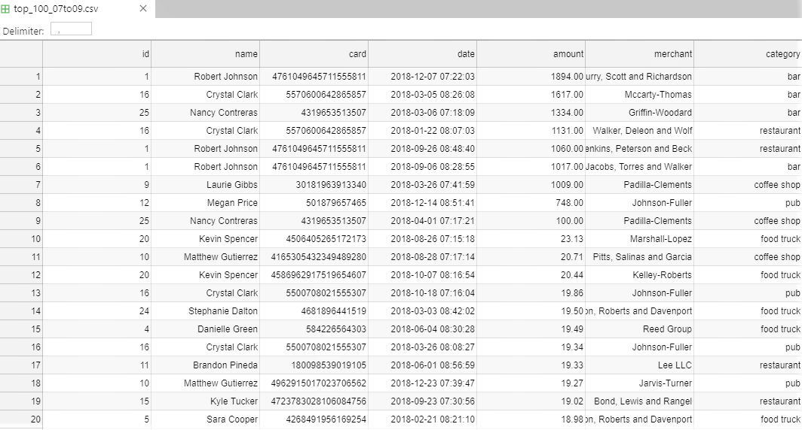
  
  *Do you see any fraudulent or anomalous transactions? Yes!*
  
  *If you answered yes to the previous question, explain why you think there might be fraudulent transactions during this time frame.*
  
      * According to table [top_100_07to09](Data/top_100_07to09.csv), the following activities appeared suspicious:
          1. For Robert Johnson, Cardholder #1:
              i. The highest transaction amount of 1894.00 dollars incurred on December 7, 2018 at 7:22am at a bar for  appeared suspicious because
                  a. Transactions at a bar usually take place during the night instead of early morning between 7am to 9am
                  b. The transaction amount was large.
              ii. It looked highly suspicious that dining at a restaurant cost 1060.00 dollars on September 26 at 8:48am, ranking the 5th highest transaction out of the 100.
                  a. Due to the same reasons specified in part i above
              iii. Similar to the above, visiting a bar and spending 1017 dollars on September 6, 2018 at 8:28am seemed fraudulent.
                  a. especially when the same cardholder was observed next on the top 100 list to be spending 14.92 dollars at a restaurant on December 11, 2018 at 7:42am.
                  b. Based on [cardholder_trans](Data/cardholder_trans.csv), Cardholder #1 made a total of 133 transactions in year 2018. 
             The three transactions ranking 1st, 5th and 6th places on the top 100 list for transactions between 7am to 9am were highly likely to be fraudulent for Robert.
             
          2. For Cardholder #16, Crystal Clark, the transactions in the amount of 1617 and 1131 dollars on March 5 and January 22, 2018 appeared fraudulent. Since
              i. Out of 220 transactions in 2018 from Crystal, four were between 7am and 9am. Only those two listed above were over 20 dollars during the two-hour time window. 
              ii. The third highest credit transaction amount took place on March 26, 2018 at 8:08am of 19.34 dollars at a pub. 
             Therefore, those two were fraud for spending over a thousand dollars at a bar and restaurant between 7am and 9am was out of the normal pattern for Crystal.
             
          3. The 3rd, 9th and 60th highest transactions by Nancy Contreras, Cardholder #25, were potentially fraudulent as
              i. The amount of transactions were large, 1334 and 100 dollars respectively at a bar and a coffee shop, significantly higher than usual costs for drink and coffee.
              ii. The next highest transaction was a 16.58 dollar spending at a bar. The time and venue of the transaction did not appear normal.
              iii. The next couple of highest transactions ranked 74th and 93rd places on the list, of 14.36 and 11.88 dollars, at a food truck and coffee shop respectively.
             It follows that the largest three transactions in amount  were abnormal and fraudulent for Nancy during 7am to 9am in 2018.     
          
          4. The 7th highest transaction for Cardholder #9, Laurie Gibbs, was highly likely to be a fraud because
              i. The transaction amount of 1009 dollars on March 26, 2018 at 7:41am was the only transaction that is over 11.65 dollars for Laurie between 7am and 9am in 2018.
              ii. The amount of transaction appeared to be significantly higher than usual spending at a coffee shop. 
             The 7th highest transaction was not authorized by Laurie. It is a fraud.
             
          5. For Megan Prince, Cardholder #12, potential fraudulent transactions were
              i. Spending 748 dollars, 8th place on the list, at Johnson-Fuller pub on December 14, 2018 8:51am because of the time, venue and transaction amount.
              ii. A 17.78-dollar transaction at Patton-Rivera bar on Aril 15, 2018 at 8:32am, 37th on the list, for it is uncommon to consume at a bar during that morning time
              iii. A transaction ranking 77th place on the list of 13.59 dollars at a pub on September 3, 2018 at 7:27am
              iv. A transaction in the amount of 11.96 dollars at a bar on January 20, 2018 at 8:35am, 90th highest transaction during the time period. 
                  * Given that there was a transaction at a food truck of 14.80 dollars on April 7, 2018 at 7:18am
                  * However, it could be the case when bars and pubs settle the transactions during night time in the morning on their point-of-sale machines. 
          
          6. As of Cardholder #10, Matthew Gutierrez, there were evidences that his credit cards are hacked because of his high frequency of appearance on the list.
              i. A visit to Jarvis-Turner pub costing 19.33 dollars on June 1, 2018 at 7:39am, ranking 18th place on the Top 100 list was suspicious since:
                 * It was the only pub visit for Matthew on the list. All others were coffee shop visits, i.e. the 11th, 22nd, 40th, 53rd transactions on the list.
             For Matthew's had five transactions on the Top 100 list for those took place from 7am to 9am in 2018, his cards were prone to being hacked. 
             
          7. Cardholder #24, Stephanie Dalton, was also seen to be prone to fraudulent transactions as she appeared seven times on the Top 100 list for 7am-to-9am transactions.
              i. The most suspicious were 69th and 91st highest transaction on the list that took place at bars and the 92nd highest that happened at a restaurant 
                  * for it is uncommon to visit bars and restaurants early in the morning 
                  * The other four visits by Stephanie on the same list were all at food trucks, ranking 14th, 29th, 52nd and 64th places
                  

*Some fraudsters hack a credit card by making several small payments (generally less than $2.00), which are typically ignored by cardholders. Count the transactions that are less than $2.00 per cardholder. Is there any evidence to suggest that a credit card has been hacked? Explain your rationale.*

*Once you have a query that can be reused, create a view for each of the previous queries.*
     i. A view "small_transactions" is created on [Queries to Detect Fraud](Answers/Code/queries.sql) 
     ii. A table ["mini_transactions"](Answers/Data/mini_transactons.csv) is created via [Supplemental Queries](Answers/Code/queries_supplemental.sql).

1. Top on the list with highest possibility of hacked credit cards were:
* Cardholder #12 Megan Prince with 26 such small transactions in year 2018
* 22 small transactions for Cardholder #11 Brandon Pineda, Cardholder #24 Stephanie Dalton and Cardholder #19 Peter Mckay
* Cardholder #10 Matthew Gurierrez with 20 such transactions
* 19 small transactions for Cardholder #20 Kevin Spencer, #13 John Martin, #16 Crystal Clark and #18 Malik Carlson
* Sean Taylor, Cardholder #7, for 18 such small transactions
* Cardholder #8 Michael Floyd, #23 Mark Lewis, #25 Nancy Contreras, #4 Danielle Green each having 16 transactions less than two dollars in 2018
* Those with ten or more transactions less than two dollars in 2018 were Cardholder #5 Sara Cooper, #15 Kyle Tucker, #2 Shane Shaffer and #1 Robert Johnson.

2. In conclusion, combining the observations from transactions under two dollars and those occured between 7am to 9am:
* Cardholder #10 Matthew Gurierrez, #12 Megan Prince, #16 Crystal Clark, #24, #25 Nancy Contreras most likely had their credit cards being hacked in 2018 due to
    * high amounts in transactions
    * high frequencies in transactions that were less than or equal to two dollars
* Moreover, credit cards were highly likely to be hacked for Cardholder #1 Robert Johnson, Cardholder #11 Brandon Pineda and Cardholder #24 as
    * they appeared on the Top 100 list for 7am to 9am transactions more than five times each
    * each person has over ten small transactions in 2018 of amounts less than or equal to two dollars
    
 
*What are the top 5 merchants prone to being hacked using small transactions?*
1. A view "vulnerable_merchants" is created on [Queries to Detect Fraud](Answers/Code/queries.sql) and table ["vulnerable_merchant"](Answers/Data/vulnerable_merchant.csv) is created via [Supplemental Queries](Answers/Code/queries_supplemental.sql). The merchants were ranked from highest to lowest based on the number of transactions less than or equal to two dollars. 
    * Note: since there were no transaction equivalent to two dollars in 2018, the numbers were the same as for transactions less than two dollars.

    
2. Based on the list above, the top five merchants prone to being hacked using small transactions that are less than two dollars in 2018 were:
    i. Wood-Ramirez bar with 7 transactions 
    ii. with 6 transactions: 
        * Hood-Phillips bar 
        * Baker Inc food truck 
    iii. Any two of the following with 5 transactions:
        * Clark and Sons food truck
        * Daniel, Hines and Mcfarland coffee shop
        * Greene-Wood bar
        * Atkinson Ltd bar
        * Reed Group food truck
        * Henderson and Sons restaurant
        * Martinez Group restaurant
        * Walker, Deleon and Wolf restaurant
        * Jarvis-Turner pub
        * Sweeney-Paul coffee shop
        * Riggs-Adams restaurant
        * Hamilton-Mcfarland restaurant

##### Additional Analysis:
Since there are high frequency of credit card frauds between 12am to 5am, an additional analysis for transactions during that time frame in 2018 was carried out in [Supplemental Queries](Answers/Code/queries_supplemental.sql).

Based on Table [Suspicious Moonlight Transactions](Answers/Data/moonlight_transactions.csv), we see that the clients with highest number of such "moonlight" bills paid on their credit cards were:
* Cardholder #16, Crystal Clark
* Cardholder #12, Megan Prince
* Cardholder #20, Kevin Spencer
* Cardholder #10, Matthew Gutierrez
* Cardholder #19, Peter Mckay

A more detailed list is show below:

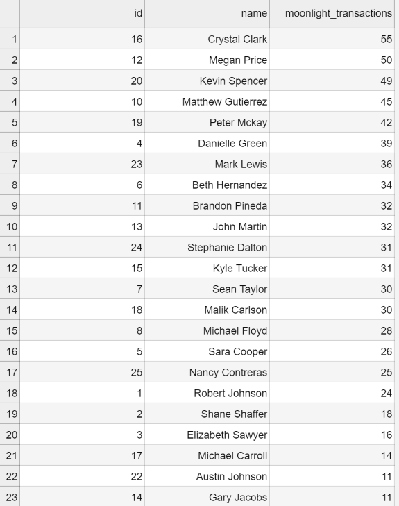

In particular, Cardholder #16 and #12 both appeared here and in previous analysis on suspicious transactions less than two dollars. Their credit cards were highly likely to being hacked in 2018.

A table [Moonlight Mini Transactions](Answers/Data/suspicious_mini_12to5am.csv)listing mini-transactions in amounts less than two dollars that occured from 12am to 5 am is created as shown here:

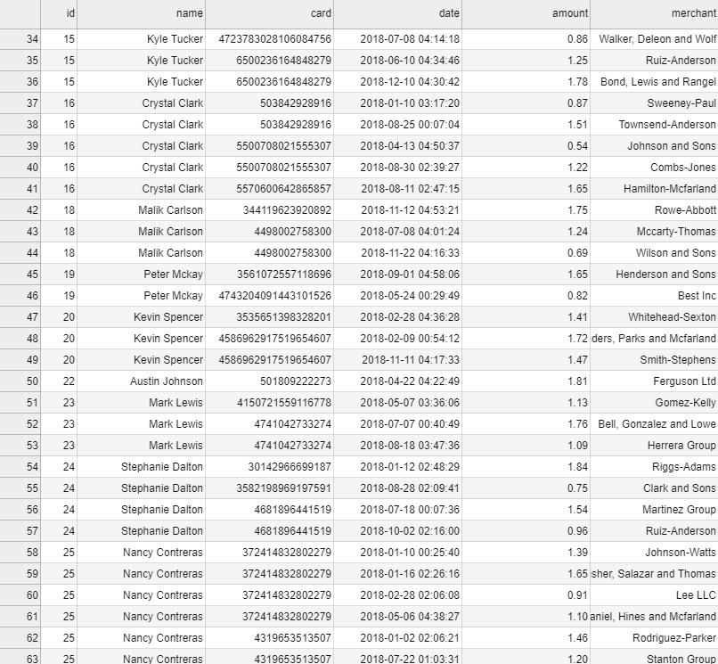

Based on the information above, Cardholder #25 Nancy Contreras appeared six times on the list, with four of those took place in the first quarter of 2018, suggesting there there was a good chance that her card was used without authorization. Besides, Cardholder #10, #12, #18, #23 and #24 also show up here. They appeared as high-risk of being hacked in previous analysis due to either large amounts in transactions or numbers of mini-transaction. It reinforces the suspicion. 

As of merchants prone to hacking during 12am to 5am, a table [Vulnerable Merchant during Moonlight](Answers/Data/vulnerable_merchants_moonlight.csv) is created. Merchants were ranked based on higher number of "moonlight" mini transactions of under two dollars. 

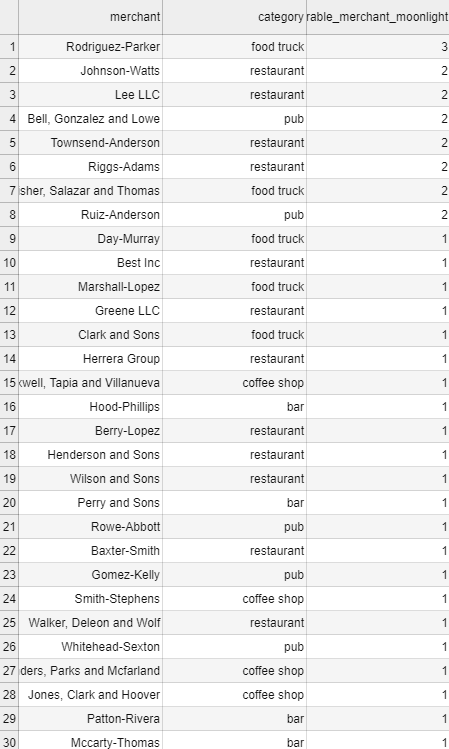

The top five among those were:
* Rodriguez-Parker food truck with three such transactions
and any four of the following with two "moonlight" transactions:
* Johnson-Watts restaurant
* Lee LLC restaurant
* Bell, Gonzalez and Lowe pub
* Twonsend-Anderson restaurant
* Riggs-Adams restaurant
* Fisher, Salazar and Thomas food truck
* Ruiz-Anderson pub
Clark and Sons food truck appeared both here and on the previous list of vulberable merchants, making it appear more vulnerable to hacking activities. 

## Create a report for fraudulent transactions of some top customers of the firm. To achieve this task, perform a visual data analysis of fraudulent transactions using Pandas, Plotly Express, hvPlot, and SQLAlchemy to create the visualizations.*

*Verify if there are any fraudulent transactions in the history of two of the most important customers of the firm. For privacy reasons, you only know that their cardholders' IDs are 18 and 2.*
    * In [Visual Data Analysis](Answers/Code/visual_data_analysis.ipynb), fetch data into pandas dataframe for Cardholder ID 2 and 18 respectively from [cardholder_tran](Answers/Data/cardholder_tran.csv) 

  *Using hvPlot, create a line plot representing the time series of transactions over the course of the year for each cardholder. In order to compare the patterns of both cardholders, create a line plot containing both lines.*
    * a line plot representing the time series of transactions for Cardholder ID #2:
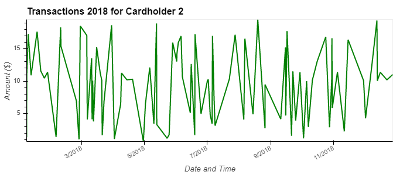
    
    * a line plot representing the time series of transactions for Cardholder ID #18:
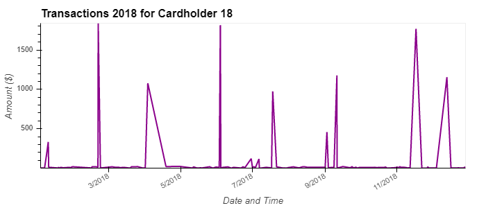
    
     * a combined line plot overlaying the time series of transactions for Cardholder ID #2 and #18:
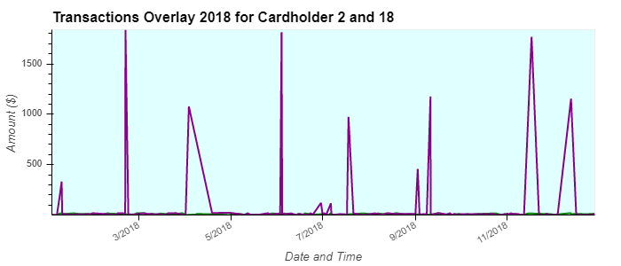
        * Note: by zooming in the original interactive hvplot, the green line representing time series transactions for Cardholder #2 will show on the bottom of the overlaying plot. 
    
  *What difference do you observe between the consumption patterns? Does the difference suggest a fraudulent transaction? Explain your rationale.*
      According to the graphs above, it is shown that:
      * The transactions for Cardholder #2 represented by green lines fluctuated in range (0, 20) in dollar amount for year 2018
      * The transactions for Card holder #18 fell in the range (0, 1800) in dollar amount in 2018 with disrupting spikes
      * The overlaying time series graph indicate that the activities patterns were similar for Cardholders #2 and #18 except for eleven spikes suggesting sudden rises in the amounts of transactions.
          * For example, the highest of those amounts occured in February 2018 with an amount close to 1800 dollars. 
          * The rest of the transactions data, i.e. those other than the spikes, fell in the range that is less than 20 dollars, same as that of Cardholder #2, suggested by the purple line. 
      In conclusion, there were fraudulent transactions for Cardholder #18 in 2018 due to abnomal consumption patterns.
      Abnormalities were identified both horizontally via time series for own transactions in 2018 and vertically by comparing to Cardholder #2 over the same time period as specified above.
  

*The CEO of the biggest customer of the firm suspects that someone has used her corporate credit card without authorization in the first quarter of 2018 to pay quite expensive restaurant bills. You are asked to find any anomalous transactions during that period.*

  *Using Plotly Express, create a series of six box plots, one for each month, in order to identify how many outliers per month for cardholder ID 25.*

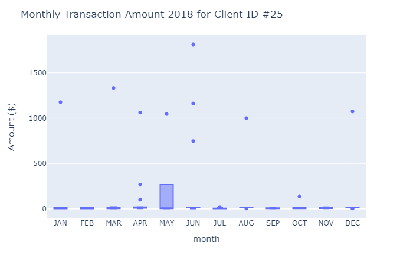
    
  *Do you notice any anomalies? Describe your observations and conclusions.*
    Yes. Looking at the series of box plot above, it is noticed that there were outliers for January and March, in the amounts of 1177 and 1334 dollars, respectively. 
    Those suggests potentially unauthorized credit transactions since the upper fence was 17.84 dollars for Januray based on overall spending activities of the month and 21.04 dollars for March. 
    In addition, the upper fence was 16.07 dollars for February, 20.03 dollars for April. There were outliers of over 1000 in transaction amounts for April, May and June respectively.
    Therefore, there were evidences suggesting unauthorized use of the client's corporate credit card in the first quarter of 2018. Anomalies shown as outliers in the box plots support the client's claim.

## Challenge

*Another approach to identify fraudulent transactions is to look for outliers in the data. Standard deviation or quartiles are often used to detect outliers.
Read the following articles (listed in the reference) on outliers detection, and then code a function using Python to identify anomalies for any cardholder.*

Please refer to [Challenge on Identifying Outliers](Answers/Code/challenge.ipynb) for analysis using sqlalchemy in python.

After reading the articles, there were two ways to identify outliers in samples:
* A. For Gaussian distribution, i.e. normal distribution of the population, use mean plus or minus three standard deviations to identify the 0.03% of sampling data as outliers. 
    * After a random sampling out of the 25 cardholders, three were selected with ID # 9, 21 and 17.
    
        For Cardholder #9:
        * The average transaction amount for Cardholder #9 in 2018 was $170.35 and the standard deviation was $430.27.
          99.7% of the data would fall between $(-1,120.46) and $1,461.15.
        * Oopse! There were 3 potentially fraudulent transactions for Cardholder #9 in 2018 in the amount of $1534, $1795 and $1724,
          occurred on March 4 at a coffee shop, June 10 at a pub, and December 19 at another pub respectively.
          Among those, the one on June 10 of $1795 appeared the most suspicious since it occured at 4:54am during the night. 
          The transaction at Maldonado Group Coffee Shop was of high alert too since the amount seemed significantly higher than regular coffee shop transactions.
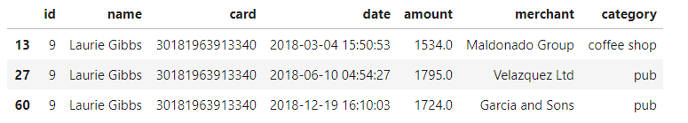
        * Command "from spiccy import stats" was used to identify the 3 ourliers that were dropped from the original 61 total transactions.
          They are the 14th, 28th and 61st transactions for Cardholder #9 in 2018, from the earliest to most recent.
          
        For Cardholder #21:
        * The average transaction amount for Cardholder #21 in 2018 was $9.52 and the standard deviation was $5.86. 
          The lower fence for outliers is $-8.06 and the higher bound for outliers is $27.11.
        * Out of the 67 transactions in 2018, there were 0 potentially frauduelent transactions for Cardholder #21 in 2018. Congrats! 
        
        For Cardholder #17: 
        * The average transaction amount for Cardholder #21 in 2018 was $10.06 and the standard deviation was $5.63. 
          The lower fence for outliers is $-6.84 and the higher bound for outliers is $26.97.
        * Congratulations! There were 0 potentially fraudulent credit transactions for Cardholder #17 in 2018 out of a total of 61 credit transactions.

* B. For non-Gaussian distribution, use box plots with upper and lower fences of 1.5 times IQR whereas IQR stands for inter-quartile range that is calculated by IQR = Q3-Q1 
    * Q3 is the 3rd quartile, meaning 75% of the sampling data take values below it. 
    * Q1 is the 1st quartile, or 25th percentile, indicating 25% of the sample data take values below the point.
    * Q2 stands for the median, a.k.a. 50th percentile. 
    
    * Following a random sampling for 3 out of 25 cardholders, Cardholder #7, 18 and 4 were chosen.
    
    For Cardholder #7:
    * The IQR for Cardholder #7 is $12.37 with lower quartile $3.66 and upper quartile $16.02.
      An upper fence of $34.58 and lower fence of $-14.90 are used to screen outliers.
    * 10 outliers, i.e. anomalies, were identified out of a total of 139 transactions in 2018 as follows:
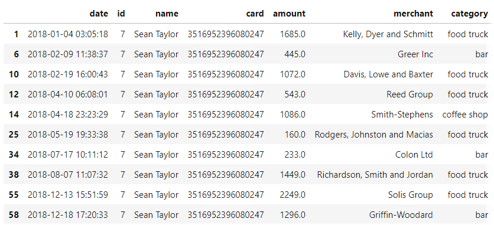
      Those are the 2nd, 7th, 11th, 13th, 15th, 26th
    * In conclusion, assuming non-Gaussian distribution for Cardholder #7, using the IQR method to identify outliers, 
      there were ten potentially fraudulent credit transactions in 2018. Two of those appears the most suspicious.
      One took place on Jan 4 in the amount of 1,685 dollars at 3:05AM at a food truck. 
      The other one took place on April 10 at 6:08AM, of 543 dollars for services provided at another food truck. 
      Both amounts were higher than purchases that usually happen at a food truck. 
      Moverover, the transaction of $1,086, at Smith-Stephens Coffee shop appears fraudulent as its number 
      was much higher than regular coffee or snack purchases and it took place at 11:23PM, 
      most coffee shops would be closed at that time.
      
    For Cardholder #18:
    * The IQR for Cardholder #18 is $12.70 with lower quartile $3.46 and upper quartile $16.16. 
      An upper fence of $35.07 and lower fence of $-15.59 are used to screen outliers.
    * Assuming non-Gaussian distribution for Cardholder #18, using the IQR method to identify outliers, 
      there were twelve potentially fraudulent credit transactions in 2018 out of a total of 133 transactions as shown below:
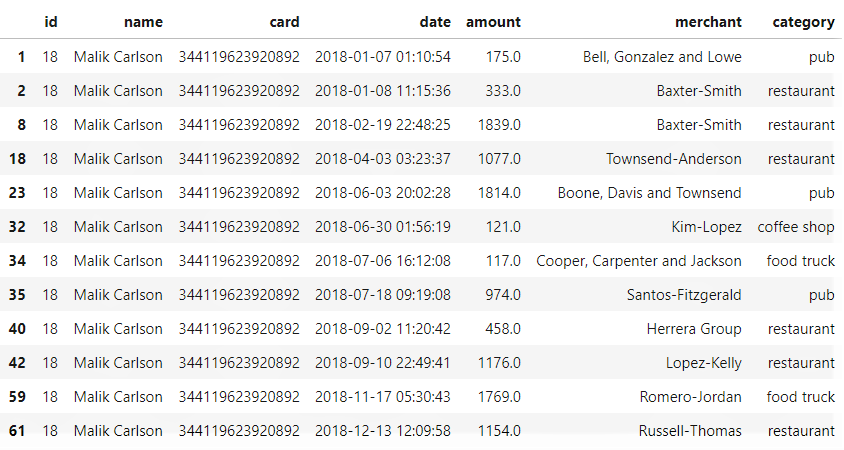
    * Six of those appears highly suspicious. 
      Based on time of transactions, one took place on Jan 7 in the amount of 175 dollars at 1:10AM at a pub. 
      On April 3, a fraudulent transaction of 1,077 dollars took place at 3:23AM at Townsend_Anderson Restaurant. 
      It was supicious that a visit to Kim-Lopez coffee shop at 1:56AM on Jun 30 would total 121 dollars as most coffee shops do not open that late.
      Another visit to Santos-Fitzgerald pub at 9:19AM on July 18 also appeared uncommon especially when it took 974 dollars. 
      If we say that, on September 10 at 10:49pm, a transaction of 1,176 dollars occured at Lopez-Kelly restaurant
      could be originated from the cardholder, then the later transactions on November 17 at 5:30AM 
      and December 13 at of 1,769 at a food truck seemed awkward as the amount appeared to be much higher than 
      normal food truck sales. 
    
    For Cardholder #4:
    * The IQR for Cardholder #4 is $8.53 with lower quartile $3.64 and upper quartile $12.17. 
      An upper fence of $24.97 and lower fence of $-9.16 are used to screen outliers.
    * There appeared to be no anomalies out of the 148 transactions in 2018. Congratulations!
   
   

### Submission in Answers folder:

* [ERD](Answers/Images/ERD.png)

* [ERD on QuickDBD](Answers/Code/ERD.txt)

* [Table Schemata](Answers/Code/table_schemata.sql)

* [Queries to Detect Fraud](Answers/Code/queries.sql)

* [Supplemental Queries](Answers/Code/queries_supplemental.sql)

* [Visual Data Analysis](Answers/Code/visual_data_analysis.ipynb).

* [Challenge on Identifying Outliers](Answers/Code/challenge.ipynb)

---

# References:
* https://app.quickdatabasediagrams.com/#/d/P2duCE
* https://www.postgresql.org/docs/8.0/functions-datetime.html
* https://stackoverflow.com/questions/31668689/select-timestamp-data-for-specific-time-range-each-day
* https://towardsdatascience.com/detecting-financial-fraud-using-machine-learning-three-ways-of-winning-the-war-against-imbalanced-a03f8815cce9
* https://en.wikipedia.org/wiki/Data_analysis_techniques_for_fraud_detection
* https://www.bluefin.com/support/identifying-fraudulent-transactions/
* https://chargebacks911.com/credit-card-fraud-detection-techniques/
* https://www.fico.com/blogs/5-keys-using-ai-and-machine-learning-fraud-detection
* https://www.w3schools.com/sql/sql_dates.asp
* https://www.practicalecommerce.com/7-telltale-signs-payment-card-fraud
* https://chargebacks911.com/fraud-red-flags/
* https://blog.bluepay.com/how-to-recognize-a-potentially-fraudulent-credit-card-user
* https://www.verifi.com/resources/10-telltale-signs-of-a-fraudulent-order-how-to-stop-chargebacks-before-they-stop-you/
* https://hvplot.holoviz.org/user_guide/Plotting.html
* https://mode.com/blog/postgres-sql-date-functions
* https://docs.python.org/3.3/library/random.html#random.sample
* https://stackoverflow.com/questions/23199796/detect-and-exclude-outliers-in-pandas-data-frame
* http://www.itl.nist.gov/div898/handbook/prc/section1/prc16.htm
* https://www.shanelynn.ie/select-pandas-dataframe-rows-and-columns-using-iloc-loc-and-ix/
* https://medium.com/datadriveninvestor/finding-outliers-in-dataset-using-python-efc3fce6ce32
* https://www.kdnuggets.com/2019/06/select-rows-columns-pandas.html
